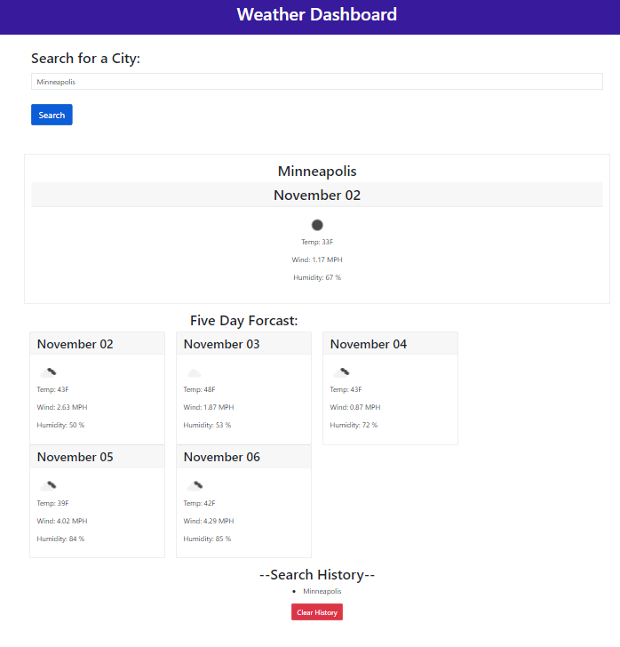

# WeatherDashboard

If you are traveling and wanting to know  a quick weather overview of the destination, this is the perfect Apps for you! Based on "city name", it will provide today's temperature information, humidity, and windspeed... as well as five days weather prediction!

## Table of Contents

- [Description](#description)
- [Installation](#Installation)
- [Usage](#usage)
- [Credits](#credits)
- [License](#license)
- [Contact](#contact)

## Description
A simple Weather App. Search for a "city name", and it will outputs temperature (min & max), humidity, and windspeed. In addition, it will include 5 day forcast. 

## Installation
1. Pull github repo into your computer. 
2. Get an API from [Open Weather Map](https://openweathermap.org/api)
3. Find a server to run your App! Whether it is Local, GitHub, or any other server hosting website.  
*NOTE: This app does not protect your API Key. 

This is a [live webpage](https://s0m3y3.github.io/WeatherDashboard/)* example.  
**NOTE: This will not be up permanently, link may be broken in the future. 

## Usage

When the app is running, it will initially use "city name" as Minneapolis, which is located in Minnesota, to generate a report. 

Input city name and click search. 

You can also click on Searched History, to re-load prior searched cities. NOTE: The history is limited to 6. 

## Credits

API from [Open Weather Map](https://openweathermap.org/), for their data for weather and geocode. 

## License
  MIT License

    Copyright (c) 2023, Github username: s0m3y3
    
    Permission is hereby granted, free of charge, to any person obtaining a copy of this software and associated documentation files (the "Software"), to deal in the Software without restriction, including without limitation the rights to use, copy, modify, merge, publish, distribute, sublicense, and/or sell copies of the Software, and to permit persons to whom the Software is furnished to do so, subject to the following conditions: The above copyright notice and this permission notice shall be included in all copies or substantial portions of the Software.
    
    THE SOFTWARE IS PROVIDED "AS IS", WITHOUT WARRANTY OF ANY KIND, EXPRESS OR IMPLIED, INCLUDING BUT NOT LIMITED TO THE WARRANTIES OF MERCHANTABILITY, FITNESS FOR A PARTICULAR PURPOSE AND NONINFRINGEMENT. IN NO EVENT SHALL THE AUTHORS OR COPYRIGHT HOLDERS BE LIABLE FOR ANY CLAIM, DAMAGES OR OTHER LIABILITY, WHETHER IN AN ACTION OF CONTRACT, TORT OR OTHERWISE, ARISING FROM, OUT OF OR IN CONNECTION WITH THE SOFTWARE OR THE USE OR OTHER DEALINGS IN THE SOFTWARE.

## Contact: 
Created by: s0m3y3  
[Github Repo](https://github.com/s0m3y3/WeatherDashboard)  
[Github live public site](https://s0m3y3.github.io/WeatherDashboard/)

Last updated: 11/01/2023